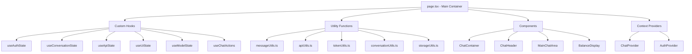

# Page.tsx Refactoring Plan

## Overview

This document outlines a comprehensive plan to refactor the monolithic `page.tsx` file (1000+ lines) into a well-organized, maintainable codebase with clear separation of concerns.

## Current Issues

The main `page.tsx` file currently contains:
- 30+ useState hooks managing different aspects of state
- Complex business logic mixed with UI rendering
- API calls and streaming logic
- Authentication and user management
- Cashu wallet and token operations
- Message and conversation handling
- Local storage operations
- UI state management

## Architecture Overview



## Phase 1: Create Custom Hooks for State Management

### 1. `hooks/useAuthState.ts`
**Purpose**: Manage authentication state and user session
**Responsibilities**:
- Authentication status tracking
- Login/logout operations
- User session persistence
- Authentication checks

**Current Code Location**: Lines 35-43, 379-446 in page.tsx

**State to Extract**:
```typescript
const [authChecked, setAuthChecked] = useState(true);
// Authentication logic from useEffect
```

### 2. `hooks/useConversationState.ts`
**Purpose**: Handle conversation and message management
**Responsibilities**:
- Conversation CRUD operations
- Message state management
- Active conversation tracking
- Conversation persistence

**Current Code Location**: Lines 55-56, 280-321, 739-831 in page.tsx

**State to Extract**:
```typescript
const [conversations, setConversations] = useState<Conversation[]>([]);
const [activeConversationId, setActiveConversationId] = useState<string | null>(null);
const [messages, setMessages] = useState<Message[]>([]);
const [editingMessageIndex, setEditingMessageIndex] = useState<number | null>(null);
const [editingContent, setEditingContent] = useState('');
```

### 3. `hooks/useApiState.ts`
**Purpose**: Manage API configuration and model state
**Responsibilities**:
- API endpoint configuration
- Model fetching and caching
- Model selection state
- API error handling

**Current Code Location**: Lines 47-49, 63-64, 324-376 in page.tsx

**State to Extract**:
```typescript
const [models, setModels] = useState<Model[]>([]);
const [selectedModel, setSelectedModel] = useState<Model | null>(null);
const [isLoadingModels, setIsLoadingModels] = useState(true);
const [mintUrl, setMintUrl] = useState('');
const [baseUrl, setBaseUrl] = useState('');
```

### 4. `hooks/useUiState.ts`
**Purpose**: Handle UI state and interactions
**Responsibilities**:
- Modal and drawer states
- Sidebar state management
- Mobile responsiveness
- Tutorial state

**Current Code Location**: Lines 61-62, 76-82, 156-277 in page.tsx

**State to Extract**:
```typescript
const [isSettingsOpen, setIsSettingsOpen] = useState(false);
const [isLoginModalOpen, setIsLoginModalOpen] = useState(false);
const [isTutorialOpen, setIsTutorialOpen] = useState(false);
const [isModelDrawerOpen, setIsModelDrawerOpen] = useState(false);
const [isSidebarCollapsed, setIsSidebarCollapsed] = useState(false);
const [isSidebarOpen, setIsSidebarOpen] = useState(false);
```

### 5. `hooks/useModelState.ts`
**Purpose**: Manage model selection and preferences
**Responsibilities**:
- Model filtering and search
- Favorite models management
- Model availability checking
- Model change handling

**Current Code Location**: Lines 85, 250-259, 802-808 in page.tsx

**State to Extract**:
```typescript
const [favoriteModels, setFavoriteModels] = useState<string[]>([]);
// Model filtering and favorite logic
```

### 6. `hooks/useChatActions.ts`
**Purpose**: Handle chat operations and AI interactions
**Responsibilities**:
- Message sending logic
- AI response streaming
- Token management for API calls
- Error handling and retries

**Current Code Location**: Lines 50-52, 57, 536-737 in page.tsx

**State to Extract**:
```typescript
const [inputMessage, setInputMessage] = useState('');
const [isLoading, setIsLoading] = useState(false);
const [streamingContent, setStreamingContent] = useState('');
// AI response and streaming logic
```

## Phase 2: Create Utility Functions

### 1. `utils/messageUtils.ts`
**Purpose**: Message content manipulation and formatting
**Functions to Extract**:
- `getTextFromContent()` (lines 212-216)
- `convertMessageForAPI()` (lines 218-223)
- `createTextMessage()` (lines 225-230)
- `createMultimodalMessage()` (lines 232-248)

### 2. `utils/apiUtils.ts`
**Purpose**: API communication and streaming
**Functions to Extract**:
- `fetchAIResponse()` (lines 536-737)
- Streaming response handling
- API error handling
- Request configuration

### 3. `utils/tokenUtils.ts`
**Purpose**: Token lifecycle and management
**Functions to Extract**:
- `getOrCreate60ApiToken()` (lines 180-208)
- Token validation and refresh
- Balance calculations
- Refund operations

### 4. `utils/conversationUtils.ts`
**Purpose**: Conversation persistence and management
**Functions to Extract**:
- `saveCurrentConversation()` (lines 280-321)
- Conversation title generation
- Message filtering for storage
- Conversation loading/saving

### 5. `utils/storageUtils.ts`
**Purpose**: Local storage operations
**Functions to Extract**:
- Generic localStorage helpers
- Data serialization/deserialization
- Storage key management
- Error handling for storage operations

## Phase 3: Create Specialized Components

### 1. `components/chat/ChatContainer.tsx`
**Purpose**: Main layout container and orchestration
**Responsibilities**:
- Overall layout structure
- Responsive design logic
- Component composition
- Event handling coordination

### 2. `components/chat/ChatHeader.tsx`
**Purpose**: Top header with model selector and controls
**Responsibilities**:
- Model selector integration
- Balance display
- Mobile menu button
- Header layout and styling

### 3. `components/chat/MainChatArea.tsx`
**Purpose**: Central chat interface
**Responsibilities**:
- Chat messages container
- Chat input container
- Streaming content display
- Message interaction handling

### 4. `components/ui/BalanceDisplay.tsx`
**Purpose**: User balance and authentication status
**Responsibilities**:
- Balance formatting and display
- Loading states
- Sign-in prompt for unauthenticated users
- Balance refresh handling

## Phase 4: Create Context Providers

### 1. `context/ChatProvider.tsx`
**Purpose**: Centralized chat state management
**Responsibilities**:
- Chat state consolidation
- Action dispatchers
- State persistence
- Cross-component communication

### 2. `context/AuthProvider.tsx`
**Purpose**: Authentication context
**Responsibilities**:
- User authentication state
- Login/logout actions
- Session management
- Authentication persistence

## Phase 5: Refactored File Structure

```
routstr-chat/
├── app/
│   └── page.tsx (simplified, ~100 lines)
├── components/
│   ├── chat/
│   │   ├── ChatContainer.tsx (new)
│   │   ├── ChatHeader.tsx (new)
│   │   ├── MainChatArea.tsx (new)
│   │   ├── ChatInput.tsx (existing)
│   │   ├── ChatMessages.tsx (existing)
│   │   ├── ModelSelector.tsx (existing)
│   │   └── Sidebar.tsx (existing)
│   └── ui/
│       └── BalanceDisplay.tsx (new)
├── hooks/
│   ├── useAuthState.ts (new)
│   ├── useConversationState.ts (new)
│   ├── useApiState.ts (new)
│   ├── useUiState.ts (new)
│   ├── useModelState.ts (new)
│   ├── useChatActions.ts (new)
│   ├── useCashuWallet.ts (existing)
│   └── ... (other existing hooks)
├── utils/
│   ├── messageUtils.ts (new)
│   ├── apiUtils.ts (new)
│   ├── tokenUtils.ts (new)
│   ├── conversationUtils.ts (new)
│   ├── storageUtils.ts (new)
│   └── cashuUtils.ts (existing)
├── context/
│   ├── ChatProvider.tsx (new)
│   └── AuthProvider.tsx (new)
└── types/
    └── chat.ts (existing)
```

## Implementation Benefits

### 1. Improved Code Organization
- **Single Responsibility**: Each file has one clear purpose
- **Logical Grouping**: Related functionality is co-located
- **Easy Navigation**: Developers can quickly find specific features
- **Clear Dependencies**: Explicit import/export relationships

### 2. Better Maintainability
- **Isolated Changes**: Modifications to one feature don't affect others
- **Easier Debugging**: Smaller, focused files are easier to troubleshoot
- **Simplified Testing**: Individual pieces can be unit tested
- **Reduced Cognitive Load**: Developers work with smaller, manageable chunks

### 3. Enhanced Reusability
- **Composable Hooks**: State logic can be reused across components
- **Shared Utilities**: Common functions available throughout the app
- **Modular Components**: UI pieces can be composed in different ways
- **Flexible Architecture**: Easy to extend and modify

### 4. Performance Improvements
- **Optimized Re-renders**: Isolated state reduces unnecessary updates
- **Code Splitting**: Smaller bundles and better loading performance
- **Memoization Opportunities**: Easier to implement React.memo and useMemo
- **Lazy Loading**: Components can be loaded on demand

## Example: Simplified `page.tsx` After Refactoring

```typescript
'use client';

import { Suspense } from 'react';
import { Loader2 } from 'lucide-react';
import { ChatProvider } from '@/context/ChatProvider';
import { AuthProvider } from '@/context/AuthProvider';
import ChatContainer from '@/components/chat/ChatContainer';

function ChatPageContent() {
  return (
    <AuthProvider>
      <ChatProvider>
        <ChatContainer />
      </ChatProvider>
    </AuthProvider>
  );
}

export default function ChatPage() {
  return (
    <Suspense fallback={
      <div className="flex items-center justify-center h-dvh w-full bg-black">
        <Loader2 className="h-8 w-8 text-white/50 animate-spin" />
      </div>
    }>
      <ChatPageContent />
    </Suspense>
  );
}
```

## Implementation Strategy

### Recommended Order
1. **Phase 2 First**: Start with utility functions (pure functions, no dependencies)
2. **Phase 1**: Create custom hooks (depend on utilities)
3. **Phase 4**: Add context providers (centralize state)
4. **Phase 3**: Build specialized components (use hooks and context)
5. **Phase 5**: Refactor main page (orchestrate everything)

### Migration Approach
- **Incremental**: Move one piece at a time
- **Test-Driven**: Ensure functionality remains intact
- **Backward Compatible**: Keep existing functionality working
- **Gradual Adoption**: Update imports as pieces are moved

## Risk Mitigation

### Potential Issues
- **State Dependencies**: Complex interdependencies between state pieces
- **Timing Issues**: useEffect dependencies and execution order
- **Context Performance**: Avoiding unnecessary re-renders
- **Import Cycles**: Circular dependencies between modules

### Solutions
- **Careful Analysis**: Map all state dependencies before moving
- **Gradual Migration**: Move related pieces together
- **Performance Testing**: Monitor re-render patterns
- **Dependency Graphs**: Use tools to detect circular imports

## Success Metrics

### Code Quality
- **Lines per File**: Target <200 lines per file
- **Cyclomatic Complexity**: Reduce complexity scores
- **Test Coverage**: Increase testability of individual pieces
- **Documentation**: Clear purpose and API for each module

### Developer Experience
- **Navigation Speed**: Faster to find specific functionality
- **Change Confidence**: Easier to make modifications safely
- **Onboarding**: New developers can understand the codebase faster
- **Debugging**: Issues can be isolated and fixed more quickly

## Next Steps

1. **Review and Approve**: Stakeholder review of this plan
2. **Create Implementation Timeline**: Break down into sprints/milestones
3. **Set Up Testing Strategy**: Ensure no regressions during refactoring
4. **Begin Implementation**: Start with Phase 2 (utilities)
5. **Monitor Progress**: Regular check-ins and adjustments

---

*This refactoring plan transforms a monolithic 1000+ line file into a well-organized, maintainable codebase that follows React best practices and modern software architecture principles.*